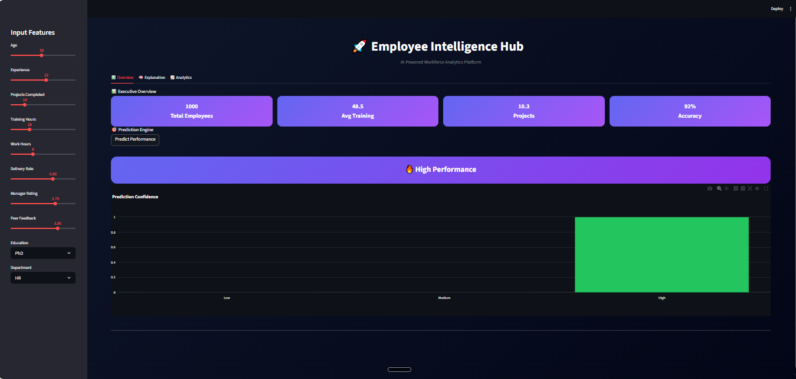
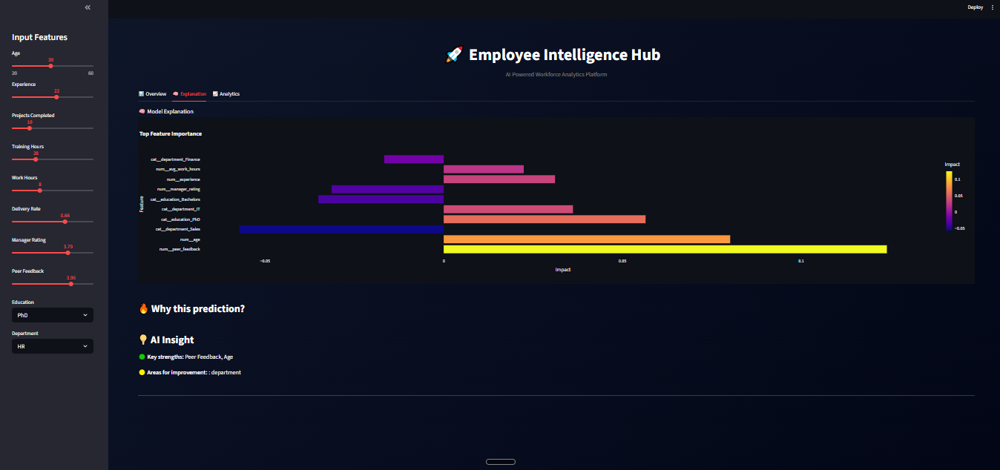
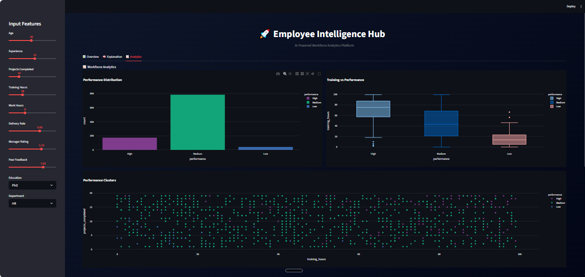

# 🚀 Employee Performance Predictor

### 🧠 AI-Powered Workforce Analytics & Prediction System


---

## 📌 Overview

An end-to-end **Machine Learning + Data Analytics project** that predicts employee performance using advanced features like:

* ⚡ **XGBoost Model** for high accuracy
* 🧠 **SHAP Explainability** for transparency
* 📊 **Interactive Streamlit Dashboard**
* 💎 **Modern Glassmorphism UI Design**

This project helps organizations make **data-driven HR decisions** by analyzing employee behavior, productivity, and performance trends.

---

## 🎯 Key Features

✅ Predict employee performance (High / Medium / Low)
✅ Real-time interactive dashboard
✅ SHAP-based model explainability
✅ KPI cards & analytics insights
✅ Dataset visualization & trends
✅ Clean ML pipeline (production-ready)

---

## 🖥️ Dashboard Preview

### 🔹 Prediction Interface

* Input employee details
* Get instant performance prediction

### 🔹 Model Explanation

* Feature importance (SHAP)
* Why the model made the prediction

### 🔹 Dataset Insights

* Performance distribution
* Training vs performance trends

---
## 📸 Screenshots


### 🔹 Prediction Result



---

### 🔹 Model Explanation (SHAP)



---

### 🔹 Analytics & Insights




## 🧠 Tech Stack

| Category        | Tools Used         |
| --------------- | ------------------ |
| Programming     | Python             |
| ML Model        | XGBoost            |
| Visualization   | Plotly, Matplotlib |
| Explainability  | SHAP               |
| Web App         | Streamlit          |
| Tracking        | MLflow             |
| Data Processing | Pandas, NumPy      |

---

## 🏗️ Project Structure

```
Employee-Performance-Predictor/
│
├── app/
│   └── app.py                # Streamlit application
│
├── data/
│   └── raw/
│       └── employee_data.csv
│
├── models/
│   └── pipeline.pkl         # Trained ML pipeline
│
├── notebooks/               # EDA & experiments
├── src/                     # Modular code (future scaling)
├── outputs/                 # Results & artifacts
│
├── requirements.txt
├── README.md
└── .gitignore
```

---

## ⚙️ Installation & Setup

### 🔹 Clone the repository

```
git clone https://github.com/yourusername/employee-performance-predictor.git
cd employee-performance-predictor
```

---

### 🔹 Create virtual environment

```
python -m venv venv
venv\Scripts\activate
```

---

### 🔹 Install dependencies

```
pip install -r requirements.txt
```

---

### 🔹 Run the app

```
streamlit run app/app.py
```

---

## 📊 Model Details

* Algorithm: **XGBoost Classifier**
* Problem Type: **Multi-class Classification**
* Target: Employee Performance
* Features:

  * Experience
  * Training Hours
  * Project Completion
  * Manager Rating
  * Peer Feedback
  * Department & Education

---

## 🔍 Explainability (SHAP)

The model includes **SHAP (SHapley Additive Explanations)** to:

* Understand feature contributions
* Improve model transparency
* Provide actionable insights

---

## 📈 Future Enhancements

🚀 Add real-time database integration
🚀 Deploy on Streamlit Cloud / AWS
🚀 Add authentication system
🚀 Advanced analytics dashboard
🚀 REST API for enterprise use

---

## 👨‍💻 Author

**Abdul Rahman Anas**
🎓 B.E CSE (AI & ML)
📍 Hyderabad, India

---

## ⭐ If you like this project

Give it a ⭐ on GitHub and share with others!

---
